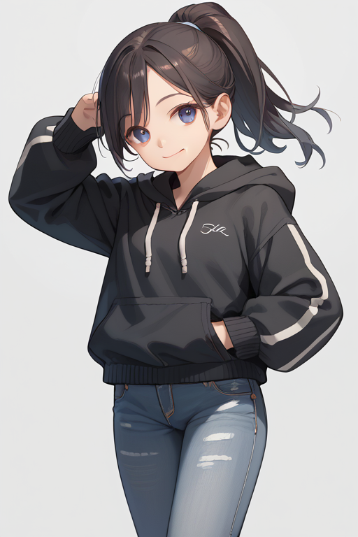

# SD-RefDrop
This is an extension for the [Forge version](https://github.com/lllyasviel/stable-diffusion-webui-forge) of the Automatic1111 Stable Diffusion web interface. (Find the reForge version of this extension [here](https://github.com/tocantrell/sd-refdrop).) Its purpose is to implement RefDrop image consistency based on [RefDrop: Controllable Consistency in Image or Video Generation via Reference Feature Guidance](https://arxiv.org/abs/2405.17661) (Fan et al. 2024). RefDrop allows for either consistency or diversification of diffusion model outputs based on an intially recorded output. 

For real-world application purposes, you can find a prompt and a seed with an output character or scene that you like and then apply aspects of that character to all future outputs. Alternatively you can also similarly find a seed with features you want to avoid and remove aspects of that image in future outputs. This level of consistency or diversification is controlled by the RFG Coefficent, which is a parameter that ranges from -1 to 1. Positive values force the outputs to be similar to the initial image while negative values ensure differences. It seems to work best in the 0.2 to 0.3 range for consistency or -0.2 to -0.3 range for diversification.

## Examples
The "Original" images were generated using a random seed, and then following images were made with a singular different seed. For the different seed a slight change was made to the prompt, denoted in brackets below:
```
Positive prompt:
score_9,score_8_up,score_7_up,
1girl,simple hoodie, jeans, solo,
light smile, [dancing,][library, studying,]
ponytail,looking at viewer,grey_background,wide_shot

Negative prompt:
score_6, score_5, score_4,
graphic t-shirt,
```
All were generated at 512x768 at CFG 7 using `Euler a` with 20 sampling steps. For this first set, all images were made using the WAI-CUTE-v6.0 fine tune of SDXL.

|   Original |    Dancing | Consistent |  Diversify |
| ------------ | ------------ | ------------ | ------------ |
|  |  |  |  |

|   Original |   Studying | Consistent |  Diversify |
| ------------ | ------------ | ------------ | ------------ |
|  |  |  |  |

The following images use the same original saved output, but then are merged or diversified with using a separate, realistic fine tuned SDXL model. In practice, I've seen how this method can apply unrealistic aspects to a model trained on photos via consistency or emphasize the details and realism of an output using a negative RFG coefficent from an initial input from a less detailed model. The authors of the original paper also showed how this output diversification method can be used to help overcome stereotypes the model may have learned.

|   Original |   Studying | Consistent |  Diversify |
| ------------ | ------------ | ------------ | ------------ |
|  |  |  |  |

## Usage Guide
Install by using the `Extensions` tab from within the Forge web interface. Navigate to the `Install from URL` tab and copy and enter the URL to this repository then click `Install`. When it finishes, go to the `Installed` tab and click `Apply and restart UI`. After reloading the interface, on the `txt2img` tab select `RefDrop` from the list of parameters.

First, find a specific image you want to use as the base for consistency or diversification. Once you've found the single image output you'll use, save its seed using the recycle symbol next to the `Seed` field. Click `Enabled` from the RefDrop menu and under `Mode` select `Save`. The RFG Coefficient doesn't matter for this first step, because at this point we are only saving the network details about the base image.

> [!WARNING]
> This will save a large amount of data to the `extensions\refdrop\latents` folder. The small "Original" image above took 5,602 files totalling 7.3GB. More detailed images using hires fix and ADetailer can go much larger. However, this data is only written to disk during the `Save` step, and these files are deleted and replaced every time you run a new `Save`.

> [!TIP]
> This extension only saves one base image data at a time. If you have multiple images you care about, it might be easiest to save the details of the prompt and seed and rerun the `Save` step as needed. Alternatively, you can backup the contents of the `extensions\refdrop\latents` folder, but this is a lot of data.

The amount of data stored can be limited by using the `Save Percentage` parameter. This option also has the added benefit of decreasing the overall run time during `Use` mode. However, using it too much can decrease the overall effect of RefDrop. Using the "studying" example, we can see this how the outputs are affected at different percentages below.

 |   Studying |   75% | 50% |  10% |
| ------------ | ------------ | ------------ | ------------ |
|  |  |  |  |

After the save step finishes and you have recreated the original image you want to use for the process, you can now switch the mode to `Use` and set the RFG coefficent as described earlier. While `Enabled` is selected all outputs will use RefDrop.

> [!IMPORTANT]
> When generating new images using RefDrop, the network parameters must be the same as the original saved image. In practical terms, this means only use models from the same lineage (for example, if using SD1.5 for the base image, only use SD1.5 fine tunes for the output). This RefDrop implementation will use the embedding data available from the `Save` step and then continue on as normal. I have not seen any issues with changing the height, width, sampling method, etc. between `Save` and `Use`.

## Afterword
A big thank you to the author of this paper for coming up with the idea and taking the time to talk with me about it at NeurIPS 2024. There is a lot left to explore in this area, including applicability to other areas such as video. One important point that needs to be addressed for this implementation is figuring out how to prune what needs to be saved in order to acheive the desired results. The current implementation is saving all K and V values that are created at any point during the image generation, which is probably overkill.
